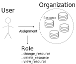
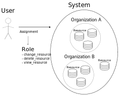

# Using DAB Role-Based Access Control

Access control allows or denies requests from a user based on some permission specification.
Roles are an implementation detail of some access control systems, such as this one.

## Model Permissions

Permissions are defined on a per-model basis, like **permission to change inventory**,
which represents the permission to modify an inventory, but _which_ inventory
is still unclear when looking at the permission itself.

Permissions combine two pieces of information

 - The **action** being taken
 - The **content type** the action applies to

## Role Definitions

The DAB RBAC system may use the word "role" or "role definition" interchangeably.
The "role definition" wording is help clarify that it is abstract,
meaning that it does not have an object association.

Roles contain two functional pieces of information (excluding things like its `name`)

 - A list of **permissions** the role gives to all asignees
 - A **content type** restriction

## Role User Assignments

When you give a user some permissions, 3 pieces of information are involved

 - The **role**
 - The **user** getting the permissions listed in that role
 - The **object** this assignment is applied to

This is illustrated in the image below. 1 user gets 1 or more permissions to the object.

## Role Team Assignments

Teams are treated like other objects in the system by DAB RBAC,
with the exception that its **member** permission acts as a multiplier.
By receiving a team's member permission, you automatically receive all
permissions that the team has.

Teams permissions tracked separately from users in the database,
which are called role-team-assignments.
You can think of a team as a grouping of users who are members of that team.
Thus, giving permissions to a team is a bulk assignment of all the users
in the team. This is illustrated in the below image.

Abstractly, teams can also get the member permission **to another team**
but this may or may not be enabled by the app using DAB RBAC
based on usability concerns.

## Organizations

Similar to how teams are a grouping of users, organizations are a grouping
of objects.
Most objects tend to have an organization field which is filled in when
creating the object, which may be required.

A role with the organization **content_type** can include **permissions**
for any **objects** inside of that organization.
When a user or team is assigned a role listing those permissions,
for a particular organization, they receive those permissions for
**all** objects in that organization.
This is illustrated below.

### Resource Tree

This concept is mainly intended for organizations, but it generalized
in DAB RBAC, so that any model can have child models if they have
a relational link between them.

So if you consider the above illustration of a user gaining permission
to an organization, the grouping of objects could have nested groupings.

## Teams and Organizations

Teams can also be given organization-level roles.
This means that _a single role assignment_ can give permission
to multiple objects to multiple users.

## System-wide Roles

DAB RBAC allows creating **system-wide role definitions**.
System-wide role definitions are idenified by a **null content_type**.
Any assignments given for this role will, correspondingly, have a **null object**.

These roles will give their listed permissions **globaly**,
in other words, for the entire system.
In most cases, this means that users who are assigned these roles have
the listed permissions to all objects of that type.

If a global role gave **permission to change inventory**, for example,
that would allow a user with that role to change **all inventories** in the system.

System-wide roles give listed permission to objects even if they are in
an organization that the user has no permission to.
Because of this, they can be said to give "super" permissions, like how
the superuser of the system has all permissions.
System-wide roles also give permission to objects that are in no organization.
This is illustrated below.

You can think of the system as grouping of objects that includes all objects
in the system. Even as some objects are a part of lower-level groupings,
like an organization, they are still a part of the system grouping.

Extra care is needed to make sure that system-wide roles do not create
a disjointed user experience.
For example, permission to view and edit all inventories in the system
can be given to a user while still not giving that user to view all
organizations. That would give the user permission to edit inventories
which are in _organizations_ the user can not view.
This example could be remedied by adding **permission to view organizations**
to the role.
