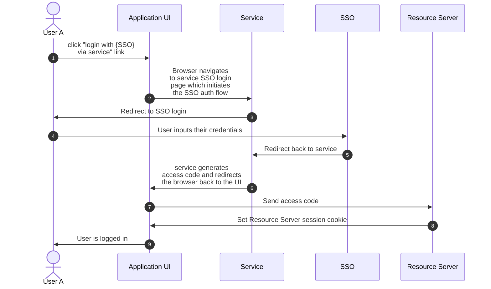

# Service Backed SSO

Services can be configured to serve as authenitcation backends for the resource server using the following authentication flow:



This can be configured by adding the following stage to the python social auth pipeline:

```
SOCIAL_AUTH_PIPELINE = (
    ...,

    # Add to end of pipeline
    "ansible_base.resource_registry.utils.service_backed_sso_pipeline.redirect_to_resource_server"
)
```

By default this will redirect the user to `{RESOURCE_SERVER_URL}/api/gateway/v1/legacy_auth/authenticate_sso/?auth_code=xxx`, with an auth code generated using the service's secret key. This behaviour can be customized by setting:

- `SERVICE_BACKED_SSO_AUTH_CODE_REDIRECT_PATH`: redirect the user to an alternative location to the default.
- `SERVICE_BACKED_SSO_AUTH_CODE_REDIRECT_URL`: customize the location that the user is redirected to in cases where the `RESOURCE_SERVER` is not publicly accessible (such as when using internal OCP hostnames)