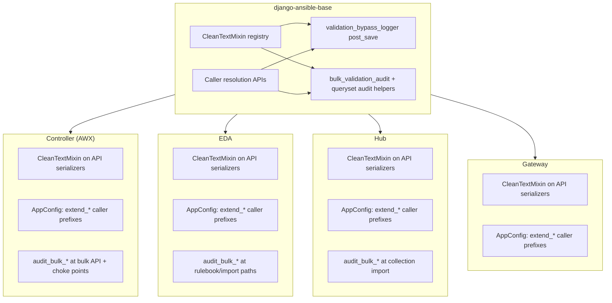

# ORM validation bypass observability

This guide describes how Ansible Automation Platform (AAP) detects and logs
**ORM-direct writes** that skip `CleanTextMixin` serializer validation. It covers
what ships in **django-ansible-base (DAB)** (Jira **AAP-86051**) and what each
**downstream service** (Controller, Gateway,
EDA, Hub) must add on top.

Related: [CleanTextMixin and validators](validation.md).

This document catalogs **ORM-direct** code paths — `Model.objects.create()`,
`instance.save()`, `queryset.update()`, `bulk_create()`, and similar — that write
to the database **without** going through a DRF serializer that uses
`CleanTextMixin`. Those paths bypass serializer-layer validation.

The handler `ansible_base.lib.utils.validation_signals.validation_bypass_logger`
(and optional `ansible_base.lib.utils.bulk_validation_audit` helpers) provides
**observability** for many of these writes by logging Tier 1/Tier 2 violations.
It does **not** block saves.

### Why this matters

`CleanTextMixin` enforces input validation at the **serializer** layer. Any code
that creates or updates instances directly via the ORM skips that layer. That is
sometimes intentional (management commands, migrations, internal sync), but it
can be a gap if untrusted data reaches those paths. These logs support security
monitoring and compliance auditing while teams prioritize remediation.

## North star (AAP-86051)

**Goal:** When **protected** models (registered via `CleanTextMixin` serializers) receive Tier 1 / Tier 2 text through an **ORM bypass path**, emit a structured **WARNING** (`ORM bypass (post_save):`, `ORM bypass (bulk_…):`, or `ORM bypass (queryset_update):`) with caller attribution. **Never block** the write.

| In scope | Boundaries (what this work does **not** change) |
|----------|--------------------------------------------------|
| Same rules as `CleanTextMixin` on Char/Text fields (minus `excluded_fields`) | **Blocking** ORM writes when validation fails (logs only) |
| `post_save` for `.save()` / `.create()` on registered models | Moving the **enforcement** boundary from serializers to `Model.save()` / `full_clean()` |
| **`audit_bulk_*`** and service wrappers before `bulk_create` / `bulk_update` | **Global** monkeypatch of `QuerySet.update` / all `bulk_*` (default: explicit hooks; see [QuerySet `update()`](#4-queryset-update-calls)) |
| Per-service caller allowlist/denylist + bulk site triage | Mandatory **model field validators** on every existing column platform-wide |
| API enforcement via **`ENHANCED_INPUT_VALIDATION_ENABLED`** (unchanged) | Treating migrations / test fixtures as production monitoring targets |
| Downstream services wiring registry, callers, and priority bulk surfaces | Expecting one DAB release alone to log every bypass in every component without service integration |

**Protected model** = at least one loaded `CleanTextMixin` serializer for `Meta.model` → `_protected_models`. No mixin → helpers and signal **no-op** (not “safe,” just **undetected**).

### Coverage decision filter

Use this before adding another hook:

1. **Model in registry?** If no → expand serializers first, or accept blind spot.
2. **`bulk_update` / `update` fields ∩ (Char/Text \ excluded_fields) ≠ ∅?** If no → skip hook (e.g. Host `ansible_facts` JSON only).
3. **Semi-trusted ingress?** (API bulk, sync, user-supplied prompts) → **hook**. Internal metrics/flags → document skip.
4. **Single-instance `.save()`** on registered models → usually **already covered** by `post_save` (inventory import, many commands).

### Priority by bypass category (typical risk → rollout order)

| Priority | Category | Signal? | Bulk helper? | Controller notes |
|----------|----------|---------|--------------|------------------|
| 1 | **Bulk create/update** (user/sync ingress) | No | **Service hooks** | Bulk hosts, bulk workflow nodes, `bulk_update_sorted_by_id`, scheduler `job_explanation` batch — see [Controller reference](#controller-awx-reference-implementation-aap-86051) |
| 2 | **`QuerySet.update()`** on text columns | No | **`audit_queryset_update`** / **`audited_queryset_update`** | See [inventory](#queryset-update-inventory); EDA project import is the primary prod hook today |
| 3 | **Management commands** | Yes, if registered | N/A | e.g. inventory import via `.save()` |
| 4 | **Signals / model methods** | Yes, if registered | Rare | Usually derived data |
| 5 | **Migrations** | Theoretical | Rare | **Skip** for monitoring |
| 6 | **Tests / fixtures** | Same as prod rules | Optional | **N/A** in prod |

**Tradeoff:** Skipping a site means **no log**, not approval of the data. Document intentional skips in PR/epic notes.

## Goals and design boundaries

| Goal | How |
|------|-----|
| Visibility when data is written via `Model.objects.create()` / `instance.save()` without going through a `CleanTextMixin` serializer | DAB `post_save` handler logs Tier 1/Tier 2 violations (**observability-only** — saves are **not** blocked) |
| Visibility for **`bulk_create` / `bulk_update`** on registered models at service-owned call sites | DAB `audit_bulk_*` helpers + service hooks (Controller example: [four bulk surfaces](#why-four-bulk-hook-surfaces-on-controller)) |
| Visibility for **`QuerySet.update()`** with literal string kwargs on registered models | DAB `audit_queryset_update` / `audited_queryset_update` at service call sites ([inventory](#queryset-update-inventory)) |
| Same validation rules as the API | Reuses `validate_resource_name` and `validate_free_text` |
| Avoid false positives on normal API traffic | Model registry + context variable around `CleanTextMixin` persistence (`save()`, `create()`, `update()`) |
| Actionable audit fields | Hybrid caller attribution (allowlist → denylist → fallback) |

### Design boundaries (not “uncovered forever”)

These are **policy and architecture choices** for this feature. They do **not**
mean `bulk_*` or `QuerySet.update()` are outside Product Security interest —
those paths still need **explicit** instrumentation where triage shows registry +
Char/Text + meaningful risk.

| Boundary | Rationale |
|----------|-----------|
| **Warn only; never block** ORM bypass writes | Tasks, signals, migrations, and legacy sync must keep working; API blocking stays on serializers (`CleanTextMixin`, `ENHANCED_INPUT_VALIDATION_ENABLED`) |
| **No platform-wide ORM enforcement** via `save()` / `full_clean()` changes | Grandfathering and the validation boundary remain at the serializer layer unless a separate initiative changes that |
| **No default global monkeypatch** of `QuerySet.update` or all `bulk_*` | High blast radius (Hub `django-lifecycle`, third-party libs, Django upgrades); prefer opt-in helpers, shared wrappers, and inventories |
| **No requirement** to add Django model field validators on every existing model | Large coordinated rollout; observability reuses the same rules as serializers without rewriting models |
| **Service integration required** | DAB ships signals + bulk helpers; Controller, Hub, EDA, and Gateway each register callers, load serializers, and hook priority bulk/sync ingress |

### How ORM paths get coverage (common misconceptions)

| Path | Covered by `post_save`? | How observability applies |
|------|-------------------------|---------------------------|
| `.save()` / `.create()` on registered models | Yes | Automatic once signals are registered and serializers are imported |
| `bulk_create()` / `bulk_update()` | **No** (Django limitation) | **`audit_bulk_*` or wrappers** at call sites that persist registered text — not automatic from DAB install alone |
| `QuerySet.update()` | **No** | **`audit_queryset_update`** / **`audited_queryset_update`** on literal kwargs; see [inventory](#queryset-update-inventory) |

**Observability-only** means security and compliance teams get **WARNING** logs;
application behavior and whether API requests fail are still governed by
`CleanTextMixin` and `ENHANCED_INPUT_VALIDATION_ENABLED` on serializers.

## Multi-component architecture

DAB is a shared library loaded into each service’s Django process. No single
repository can implement full coverage alone.



| Layer | Owner | Responsibility |
|-------|--------|----------------|
| Validators + mixin | DAB | Tier 1/Tier 2 rules; serializer enforcement and grandfathering |
| Single-instance ORM bypass logging | DAB | `ansible_base.lib.utils.validation_signals` + observability app wiring |
| Bulk/sync bypass logging | **Each service** | Call `bulk_validation_audit` (or validators) immediately before bulk ORM writes at high-risk sites |
| Meaningful `[caller: …]` in logs | **Each service** | Register narrow allowlist and/or extra denylist prefixes at startup |
| Expanding which models are monitored | **Each service** | Add `CleanTextMixin` to more DRF serializers (registry grows automatically) |

Until a service registers caller prefixes, logs may show `unknown` or a
low-confidence fallback frame. Until bulk hooks land, **sync/import paths remain
the largest blind spot** even when single-instance logging is enabled.

## DAB implementation

### Modules

| Module | Role |
|--------|------|
| `ansible_base.lib.utils.validation_signals` | `validation_bypass_logger` (`post_save`); `_protected_models` registry; `get_validation_context_token` / `reset_validation_context`; `register_validation_signals()`; `extend_caller_allowlist_prefixes()` / `extend_internal_caller_prefixes()`; shared `_validate_field` / caller resolution used by bulk and queryset helpers |
| `ansible_base.lib.utils.bulk_validation_audit` | `audit_bulk_model_instances`, `audit_bulk_item_dicts` (`bulk_create` / `bulk_update` instances or dicts); `audit_queryset_update`, `audited_queryset_update` (literal `QuerySet.update()` kwargs) |
| `ansible_base.lib.serializers.mixins.CleanTextMixin` | API Tier 1/2 validation; registers `Meta.model` with the bypass registry via `register_protected_model` |
| `ansible_base.lib.utils.validation` | `validate_resource_name`, `validate_free_text` (rules reused by mixin and bypass logs) |
| `ansible_base.observability.apps` | **`ansible_base.observability` must be in `INSTALLED_APPS`** so `ObservabilityConfig.ready()` calls `register_validation_signals()` and wires `post_save` for ORM-direct writes (services may also call `register_validation_signals()` from their own `AppConfig`) |

### Detection flow (single-instance saves)

1. **Registry:** Skip if `sender` is not a model registered by a `CleanTextMixin` serializer (scope matches “models covered by CleanTextMixin in serializers”, not every model in the process).
2. **Context var:** Skip if the save originated from `CleanTextMixin` persistence — `save()`, `create()`, or `update()` (see [Serializer path vs ORM bypass logging](#serializer-path-vs-orm-bypass-logging-no-double-logging)).
3. **Fields:** Same discovery as the mixin (`CharField` / `TextField`), minus registered `excluded_fields`.
4. **Validate:** Run Tier 1 on `name_fields`, Tier 2 on other text fields.
5. **Log:** Only if step 4 finds a violation — emit WARNING with resource type, field, tier, sanitized reason, and caller. **Independent of** `ENHANCED_INPUT_VALIDATION_ENABLED`. Valid ORM field values produce **no** `ORM bypass (`…`) log line.

### Serializer path vs ORM bypass logging (no double logging)

Two different mechanisms apply on API traffic; do not confuse them with the
enforcement toggle.

| Mechanism | Logger / message | When it runs | Blocks save? |
|-----------|------------------|--------------|--------------|
| **`CleanTextMixin.validate()`** | Serializer mixin (`Validation rejected …`) | DRF `is_valid()` on serializers that use the mixin | Only if **`ENHANCED_INPUT_VALIDATION_ENABLED`** is **true** (raises `ValidationError` → 400) |
| **`validation_bypass_logger`** | `ORM bypass (post_save): …` | `post_save` on registered models | **Never** (observability only) |

**Normal API create/update (serializer path):**

1. `validate()` runs Tier 1/2 checks. On violation, the mixin logs **`Validation rejected …`**. If enforcement is **on**, it also raises and the instance is **not** saved. If enforcement is **off**, it does **not** raise; the request may still call `serializer.save()` (or list `save()` via `many=True`) with values that failed validation.
2. **`CleanTextMixin.save()`**, **`create()`**, and **`update()`** each set the same **context flag** for the duration of ORM persistence they perform (including any `post_save` receivers triggered during that write). Single-object requests use `save()` → `create()`/`update()`; **`many=True`** list endpoints call child **`create()`** / **`update()`** without child **`save()`**, so the flag must be set on those methods too.
3. `validation_bypass_logger` runs on `post_save` but **returns immediately** while the flag is set — **no** `ORM bypass (post_save):` log, even when enforcement is **off** and bad text was persisted.

So double logging is prevented by the **context variable around mixin persistence** (`save()` / `create()` / `update()`), not by `ENHANCED_INPUT_VALIDATION_ENABLED`. The toggle controls whether the **API** rejects bad input before save; it does **not** turn the bypass signal on or off. Bypass logs are suppressed for ORM writes that happen **inside** those methods, not merely because `is_valid()` ran.

**ORM-direct path** (shell, tasks, signals that call `.save()` / `.create()` without going through `CleanTextMixin` persistence hooks, etc.): no context flag. If stored text would fail Tier 1/2, the handler logs **`ORM bypass (post_save):`** and still allows the write.

### Registry and dynamic serializer configuration

| Configuration | When registered | Example |
|---------------|-----------------|---------|
| Static `name_fields` / `excluded_fields` on the class | Import (`__init_subclass__`) | Typical `ModelSerializer` |
| `@cached_property` / dynamic exclusions | Each serializer `__init__` (unioned) | Controller settings serializers |

- **DRF `validate()` / enforcement:** unchanged.
- **Multiple serializers per model:** `name_fields` and `excluded_fields` are **unioned** across registrations.
- **Residual:** Dynamic exclusions apply to ORM bypass checks after at least one serializer instance for that class exists in the process.

### Grandfathering vs ORM bypass

- **API path:** Unchanged values on update are grandfathered in `validate()`; mixin persistence (`save()` / `create()` / `update()`) sets the context var so the signal does not re-audit that write.
- **ORM-direct path:** The signal validates **current field values** on the instance; grandfathering does not apply (intentional for bypass auditing).

### Caller attribution (hybrid)

Outward stack walk from the signal handler:

1. **Allowlist:** `CALLER_INFO_APP_MODULES` setting and/or `extend_caller_allowlist_prefixes()` — first matching frame wins. Use **narrow** prefixes (tasks, API views, management commands), not entire app roots.
2. **Denylist:** DAB defaults (`django.db.models`, `django.dispatch`, `ansible_base.lib.utils.validation_signals`, `ansible_base.lib.abstract_models`, …) plus `extend_internal_caller_prefixes()` per service (e.g. shared `CommonModel.save()` wrappers).
3. **Fallback:** First frame outside `django.*` and DAB utility modules, else `"unknown"`.

DAB cannot hardcode Controller/EDA/Hub/Gateway module trees; **caller quality depends on downstream registration**.

### Bulk and QuerySet audit helpers

Because `post_save` never runs for `bulk_create()`, `bulk_update()`, or
`QuerySet.update()`, DAB provides optional helpers that use the **same registry
and validators** as the signal:

```python
from ansible_base.lib.utils.bulk_validation_audit import (
    audit_bulk_model_instances,
    audit_bulk_item_dicts,
    audit_queryset_update,
    audited_queryset_update,
)

instances = audit_bulk_model_instances(instances, operation="bulk_create")
MyModel.objects.bulk_create(instances)
# or, before constructing instances:
item_dicts = audit_bulk_item_dicts(MyModel, item_dicts, operation="bulk_create")
MyModel.objects.bulk_create([MyModel(**d) for d in item_dicts])

# bulk_update: pass update_fields= to audit only columns being written (avoids deferred-field queries).
audit_bulk_model_instances(instances, operation="bulk_update", update_fields=["description"])

# Literal kwargs only — F(), Case, subqueries are skipped (SQL value unknown).
audit_queryset_update(MyModel, {"description": user_supplied})
MyModel.objects.filter(pk=pk).update(description=user_supplied)
# or:
audited_queryset_update(MyModel.objects.filter(pk=pk), description=user_supplied)
```

Log prefix: `ORM bypass (bulk_create): …`, `ORM bypass (bulk_update): …`, or
`ORM bypass (queryset_update): …`. **Log only; do not block** writes unless product
policy requires blocking elsewhere.

When the same request already ran `CleanTextMixin.validate()` and logged
**`Validation rejected …`** for a `(resource_type, field_name)` pair, bulk and
`post_save` bypass helpers **skip** a duplicate `ORM bypass (`…`)` line for that
pair until serializer-mediated persistence finishes (`serializer_mediated_persistence_context`
or mixin `save()` / `create()` / `update()`). Custom `create()` implementations that
bulk-write should wrap persistence in that context so the dedupe registry is cleared
after the request.

Services may wrap shared helpers (Controller example: **`audit_bulk_update_instances(instances, fields)`**) so only columns named in `fields` that are registered Char/Text are checked — avoiding noise when bulk-updating JSON (e.g. Host `ansible_facts`) while unrelated text on the in-memory instance is unchanged.

**Workflow prompt fields (Controller):** `limit`, `job_tags`, `skip_tags`, `scm_branch` live in `char_prompts` (`NullablePromptPseudoField`), not as ORM `CharField`s. Bulk workflow launch must audit via **`getattr`** after deferred attrs are set, in addition to `audit_bulk_model_instances`.

**Rejected alternative:** monkeypatching `QuerySet` in DAB (platform-wide risk, interaction with libraries such as `django-lifecycle` on Hub).

### Performance and blast radius

- Django invokes the connected `post_save` handler on **every** model save; unregistered models pay a dict lookup and return.
- **Expensive work** (stack walk + validation) runs only for **registered** models when the save was **not** serializer-mediated.
- Prefer registering API-facing resources; load-test registered models under realistic ORM save rates before broad production reliance.
- **`many=True`:** Covered by the same persistence context as single-object API traffic (child `create()` / `update()`); see [Serializer path vs ORM bypass logging](#serializer-path-vs-orm-bypass-logging-no-double-logging).

### Log format (single-instance)

```
WARNING ansible_base.lib.utils.validation_signals: ORM bypass (post_save): validation rejected 'description' on test_app.Organization (violates Tier 2) [caller: my_app.views.create_org:42]: This field can't include HTML tags, script markup, or unsafe URI schemes.
```

Raw field values are **not** logged.

## Downstream integration (Controller, Gateway, EDA, Hub)

These changes land in **follow-up work** in each service repo. They are not
required to adopt a new DAB release, but production value is limited until they
are in place.

### Controller (AWX) reference implementation (AAP-86051)

**Implementation:** [ansible/awx#16672](https://github.com/ansible/awx/pull/16672) (draft; branch `AAP-86051` — **not merged** to upstream `devel` yet). Depends on [django-ansible-base#1147](https://github.com/ansible/django-ansible-base/pull/1147).

| Deliverable | Status |
|-------------|--------|
| `configure_validation_bypass_observability()` + caller prefixes | In [awx#16672](https://github.com/ansible/awx/pull/16672) |
| `import awx.api.serializers` in `AppConfig.ready()` (registry) | In PR |
| `audit_bulk_model_instances` — bulk host API | In PR |
| `audit_workflow_job_nodes_for_bulk_create` — bulk workflow launch | In PR |
| `audit_bulk_update_instances` — field-scoped `bulk_update` | In PR — `bulk_update_sorted_by_id`, scheduler `job_explanation` batch |
| Functional / unit tests for above | In PR |
| `QuerySet.update()` on registered text | **No AWX prod site** — use DAB `audited_queryset_update` elsewhere (EDA); see [inventory](#queryset-update-inventory) |

**Depends on:** DAB release containing `ansible_base.lib.utils.bulk_validation_audit`.

#### Why four bulk hook surfaces on Controller

**Single-instance writes** on registered models are already covered by DAB
`post_save` once `import awx.api.serializers` runs in `AppConfig.ready()` —
inventory import, management commands, and most sync code use `.save()` / `.create()`
and do not need a separate bulk hook per call site.

**Bulk writes** never fire `post_save`. Controller therefore adds **four** hook
surfaces where bulk ORM meets **semi-trusted ingress** or **shared choke points**,
instead of pasting `audit_bulk_*` before every `bulk_create` / `bulk_update` in
the tree:

| # | Hook surface | AWX location | What it covers |
|---|--------------|--------------|----------------|
| 1 | `audit_bulk_model_instances` | Bulk host API (`BulkHostCreateSerializer.create`) | User-supplied host dicts → `Host.objects.bulk_create` |
| 2 | `audit_workflow_job_nodes_for_bulk_create` | Bulk job launch (`BulkJobLaunchSerializer`) | `WorkflowJobNode` rows + `char_prompts` pseudo-fields (`limit`, `job_tags`, …) before `bulk_create` |
| 3 | `audit_bulk_update_instances` inside `bulk_update_sorted_by_id` | `awx/main/utils/db.py` | Every caller that bulk-updates through the helper; only columns in `fields=` that are registered Char/Text are scanned |
| 4 | `audit_bulk_update_instances` before direct `bulk_update` | `awx/main/scheduler/task_manager.py` | Scheduler batch on `job_explanation` for `Job` (uses `UnifiedJob.objects.bulk_update`, not `db.py`) |

Hooks **3** and **4** are both field-scoped `bulk_update` audit; they are listed
separately because production uses both a **shared helper** and one **direct**
`bulk_update` on registered text.

**Why not wire the remaining production bulk sites?** `audit_bulk_*` only logs when
(1) the model is in `_protected_models` and (2) the bulk operation persists
registered Char/Text (for `bulk_update`, intersection with `fields=`). Adding a
hook where either condition fails produces **no log** until the registry or call
site changes — useful as future-proofing, but it does not improve observability
today. The table below is the AWX production inventory used to prioritize the
four surfaces above; re-run triage when new `CleanTextMixin` serializers ship or
bulk paths start updating text columns.

| Production site (AWX) | Bulk API | Typical `fields` / payload | Model in registry? | Bulk hook? | Rationale |
|---------------------|----------|----------------------------|--------------------|------------|-----------|
| Bulk host API | `bulk_create` | `name`, `description`, … | Yes (`Host`) | **Yes** (#1) | Primary user bulk ingress for hosts |
| Bulk workflow launch | `bulk_create` | nodes + prompt pseudo-fields | Yes (`WorkflowJobNode`) | **Yes** (#2) | User-supplied launch prompts |
| Facts / host maintenance | `bulk_update` via `bulk_update_sorted_by_id` | `ansible_facts`, `ansible_facts_modified` | Yes (`Host`) | **Yes** (#3) | Field-scoped audit runs but **no Tier 1/2 text** in `fields` — no log noise |
| Host metrics rollup | `bulk_update` via `bulk_update_sorted_by_id` | `license_consumed`, `hosts_added`, … | Partial (`HostMetricSummaryMonthly` not mixin-covered) | **Yes** (#3) | Numeric / metric columns only |
| Scheduler job explanations | `bulk_update` | `job_explanation` | Yes (`Job`) | **Yes** (#4) | Registered text column; content usually system-generated; audit for parity |
| Scheduler workflow nodes | `bulk_update` | `do_not_run` | Yes (node model) | No | Boolean flag — not Char/Text Tier 1/2 |
| Instance link maintenance | `bulk_update` | `link_state` | No / not text tier | No | Operational enum-like state |
| Inventory task impact batch | `bulk_update` | `task_impact` | Yes (`UnifiedJob` family) | No | Integer field — not Char/Text |
| Job event callback buffer | `bulk_create` | event rows | No (`JobEventSerializer` without `CleanTextMixin`) | No | Hook would **no-op** until registry includes event models |
| Playbook stats / host summary | `bulk_create` | `JobHostSummary` (+ `host_name`) | No (summary serializer without mixin) | No | Hook would **no-op** today; revisit if mixin added |
| Host metrics automation | `bulk_create` / `.update()` | `hostname`, counters | No (`HostMetric` without mixin) | No | Hook would **no-op** today |
| Workflow M2M through table | `bulk_create` | FK join rows | N/A | No | No free-text columns |
| RBAC role backfill | `bulk_create` | `Role` rows | No (DAB internal) | No | Trusted internal plumbing |
| Smart inventory / indirect audit | `bulk_create` | membership / audit rows | No | No | Not in Controller text registry |

**When to add another hook:** model ∈ registry **and** bulk write includes Char/Text
in `fields=` (or instance dict for `bulk_create`) **and** data is semi-trusted or
user-shaped. Prefer routing `bulk_update` through `bulk_update_sorted_by_id` (or a
service-wide `audited_bulk_update` wrapper) over scattering one-off calls. Use an
automated inventory (grep + field analysis) before each release if the registry
grows.

**Related:** `QuerySet.update()` uses the same validators via
[queryset helpers](#bulk-and-queryset-audit-helpers); see [inventory](#queryset-update-inventory).

### 1. Caller registration (`AppConfig.ready()`)

Register **before** relying on `[caller: …]` in production logs.

**Controller (AWX)** — illustrative prefixes; narrow to real entry points:

```python
# awx/main/apps.py (or conf AppConfig) — example only
from ansible_base.lib.utils.validation_signals import (
    extend_caller_allowlist_prefixes,
    extend_internal_caller_prefixes,
)

def ready(self):
    extend_caller_allowlist_prefixes([
        "awx.main.tasks",
        "awx.api.views",
        "awx.main.management",
    ])
    extend_internal_caller_prefixes([
        "awx.main.models",
    ])
```

**EDA** — e.g. `aap_eda.core.tasks`, `aap_eda.api.views`; denylist `aap_eda.core.models`.

**Hub** — signal + caller wiring can land before serializers; **`CleanTextMixin` on Galaxy API serializers** (e.g. [galaxy_ng PR 786](https://github.com/ansible-automation-platform/galaxy_ng/pull/786)) grows the registry. After merge: **`import` serializer modules in `AppConfig.ready()`**, then triage collection/import **`bulk_create`** paths for `audit_bulk_*` where user text hits registered models.

**Gateway** — API views and auth flows; denylist internal model plumbing.

Optional settings:

```python
CALLER_INFO_APP_MODULES = [
    "awx.main.tasks",
    "awx.api.views",
]
```

### 2. Bulk / sync / import hooks

Add `audit_bulk_*` (or direct validator calls) **immediately before** bulk ORM
writes at paths that ingest external or semi-trusted data:

| Service | Typical high-risk paths |
|---------|-------------------------|
| **Controller** | Project SCM sync, inventory source updates, LDAP/SAML user sync |
| **EDA** | Rulebook / project content import, bulk persistence of synced objects |
| **Hub** | Collection sync and import pipelines |
| **Gateway** | Fewer bulk imports; focus on caller registration unless specific bulk admin paths exist |

Example pattern:

```python
from ansible_base.lib.utils.bulk_validation_audit import audit_bulk_item_dicts

rows = audit_bulk_item_dicts(JobTemplate, rows, operation="bulk_create")
JobTemplate.objects.bulk_create([JobTemplate(**r) for r in rows])
```

### 3. Serializer wiring (ongoing)

Each `CleanTextMixin` serializer **automatically** adds its `Meta.model` to the
ORM bypass registry. Service wiring epics that add the mixin to more endpoints
**expand observability** without further DAB changes.

### 4. Operational checklist per service

- [ ] `register_validation_signals()` (or observability app) + `extend_caller_allowlist_prefixes` / `extend_internal_caller_prefixes`
- [ ] **`import …serializers`** (or equivalent) in `AppConfig.ready()` so `_protected_models` is populated
- [ ] `audit_bulk_*` at agreed bulk API / sync / choke-point call sites
- [ ] `audited_queryset_update` (or `audit_queryset_update`) where [inventory](#queryset-update-inventory) marks **Hook required**
- [ ] Staging load test on heavily saved registered models (jobs, events, inventory)
- [ ] Log pipeline alert on `ORM bypass (` (e.g. `(post_save)`, `(bulk_create)`, `(queryset_update)`)
- [ ] Document triage outcomes for bulk / `QuerySet.update()` sites (see [Controller bulk inventory](#why-four-bulk-hook-surfaces-on-controller) and [QuerySet inventory](#queryset-update-inventory))

**Controller (AWX):** merge [awx#16672](https://github.com/ansible/awx/pull/16672) after DAB #1147; platform follow-up includes Hub/Gateway registry wiring, ops alerting, and re-inventory when the registry grows.

## QuerySet.update() inventory

Django emits **no** `post_save` for `QuerySet.update()`. Use
**`audit_queryset_update(model, kwargs)`** before the update, or
**`audited_queryset_update(queryset, **kwargs)`** as a drop-in wrapper. Only
**literal `str`** values in `kwargs` are validated; `F()`, `Case`, and subqueries
are skipped (final row values are not known without a `SELECT`).

**When to hook:** `model` ∈ `_protected_models` **and** `update(kwargs)` includes
at least one registered Char/Text key (minus `excluded_fields`) with a string
literal. **When to skip:** kwargs are booleans, integers, FK ids, hashes, or
`F()` expressions only — hooking would no-op today but is acceptable for
consistency.

### Production sites (platform triage)

| Component | Location | `update()` kwargs | Registry / text? | Hook? | Rationale |
|-----------|----------|-------------------|------------------|-------|-----------|
| **EDA** | `imports.py` — `_update_activations_for_rulebook` | `rulebook_rulesets`, `rulebook_rulesets_sha256`, `git_hash` | Yes — `Activation` (`TextField` rulesets) | **Yes** — `audited_queryset_update` | SCM-synced YAML on activations without serializers; **this** call can emit `ORM bypass (queryset_update)` if rulesets violate Tier 2 |
| **EDA** | `imports.py` — `_sync_rulebook` (rulesets unchanged) | `git_hash` only | Yes — `Activation` | **Yes** — `audited_queryset_update` (same helper) | Same pattern for consistency; kwargs are hash-only so audit **usually no-ops** (no registered text in `update()`) |
| **EDA** | `api/views/project.py` | `import_task_id` | Project registered; field is task id | No | Operational id, not user HTML ingress |
| **EDA** | `conf/registry.py` | `Setting.value` | `Setting` not mixin-covered | No | Internal config store |
| **Controller** | Task manager, jobs, system, receptor, events, signals, … (~15 sites) | `status`, flags, `link_state`, `event_queries_processed`, empty `start_args`, etc. | Often registered models | No | No prod path updates `name` / `description` / `job_explanation` via `update()` (`job_explanation` uses **bulk_update** + audit) |
| **Gateway** | `utils/service_id_sync.py` | `service_id` | `ServiceCluster` registered; UUID not Tier text | No | Assign service identity, not `name` |
| **Gateway** | DAB models (`RoleDefinition`, `Authenticator`, OAuth2) | *(none in Gateway app code)* | Serializers in `ansible_base.*` | No prod `.update(name=…)` | Tests use `.update(name=…)` to simulate legacy DB; defensive policy optional |
| **Hub** (`galaxy_ng` app) | — | — | — | **None in app tree** | Persistence uses `.save()` / Pulp; [PR 786](https://github.com/ansible-automation-platform/galaxy_ng/pull/786) adds mixins — wire `ready()` + bulk import triage, not `update()` |
| **DAB** (`ansible_base`) | — | — | `RoleDefinition`, `Authenticator`, OAuth2 mixins | No prod `objects.filter().update()` | JWT `update_or_create` + `.save()` use **post_save**; RBAC `bulk_create` is not text registry |

### Optional hardening (not required by triage today)

| Action | Why |
|--------|-----|
| Controller / Gateway: route **all** `update()` on registered models through `audited_queryset_update` | Future-proof if someone adds `update(description=…)` |
| Gateway `ready()`: `import ansible_base.rbac.api.serializers`, `ansible_base.authentication.serializers` | Ensures DAB shared models are in `_protected_models` at startup |
| CI grep: `.update(` on protected models must use `audited_queryset_update` | Catches new call sites |

### Tests that document the bypass class

Integration tests in **DAB** (`test_app`), **Gateway**, and **EDA** use
`.update(name=…)` / `.update(description=…)` to simulate pre-validation database
rows for grandfathering. Those are **not** production paths; they show why
`audit_queryset_update` exists if product code ever mirrors them.

## Remediation when a violation is logged

1. Use `[caller: …]` to find the write site.
2. Classify data source (trusted config vs external/sync vs user input).
3. **Preferred fixes:**
   - Single-instance: route through a `CleanTextMixin` serializer where appropriate.
   - Bulk: validators or `audit_bulk_*` at the sync/import site (already logging); then fix upstream data or add serializer validation on API ingress.
   - `QuerySet.update()`: use `audited_queryset_update` or fix upstream data; for `F()`-based updates, consider a read-then-validate path if product requires parity.
4. If bypass is intentional, document in code and optionally exclude fields via `excluded_fields` on the serializer (union affects ORM bypass scope for that model).

### DAB library internal bulk (RBAC, resource registry)

Django **`bulk_create`** in `ansible_base` (RBAC pipeline, resource registry backfill) does not fire `post_save`. Those rows are usually **not** in `_protected_models` (no `CleanTextMixin` on `ObjectRole`, `Resource`, etc.) — **`audit_bulk_*` would no-op today**. Treat as **trusted internal plumbing** unless Product Security requires parity; then register models + hook at choke points in DAB.

## Limitations

- No `post_save` for bulk or `QuerySet.update()` — use bulk helpers, [Controller bulk inventory](#why-four-bulk-hook-surfaces-on-controller), and [QuerySet inventory](#queryset-update-inventory).
- `audit_queryset_update` inspects **literal** string kwargs only, not SQL expressions or per-row values already in the database.
- Only models with at least one `CleanTextMixin` serializer are in scope.
- Union of `excluded_fields` across serializers can skip ORM checks on fields one team excluded (e.g. template bodies) while another serializer would validate them on the API.
- Bypass logging is always on for registered ORM bypass saves; there is no separate flag to disable only the signal path.
- Caller strings are only as good as per-service allowlist/denylist configuration.

## See also

- [validation.md](validation.md) — `CleanTextMixin`, tiers, grandfathering, `ENHANCED_INPUT_VALIDATION_ENABLED`
- [ansible_base/lib/utils/validation_signals.py](../../ansible_base/lib/utils/validation_signals.py)
- [ansible_base/lib/utils/bulk_validation_audit.py](../../ansible_base/lib/utils/bulk_validation_audit.py)
- [ansible_base/lib/serializers/mixins.py](../../ansible_base/lib/serializers/mixins.py)
