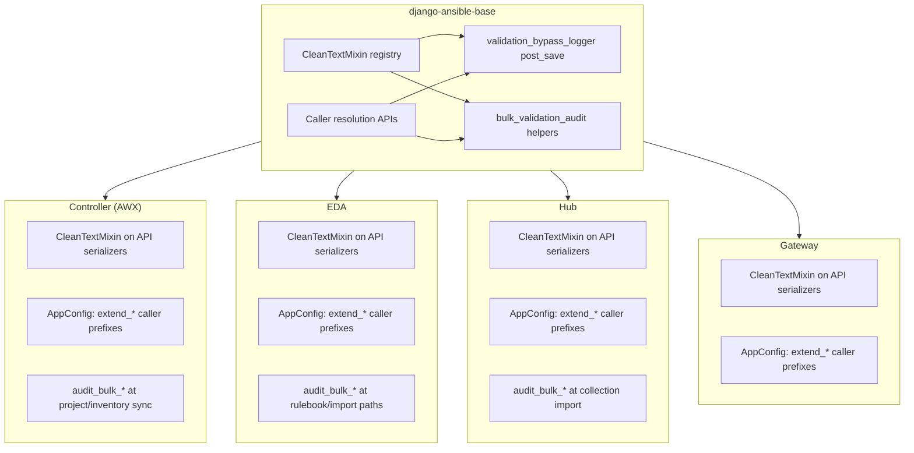

# ORM validation bypass observability

This guide describes how Ansible Automation Platform (AAP) detects and logs
**ORM-direct writes** that skip `CleanTextMixin` serializer validation. It covers
what ships in **django-ansible-base (DAB)** (Jira **AAP-86051**) and what each
**downstream service** (Controller, Gateway,
EDA, Hub) must add on top.

Related: [CleanTextMixin and validators](validation.md).

## Goals and non-goals

| Goal | How |
|------|-----|
| Visibility when data is written via `Model.objects.create()` / `instance.save()` without going through a `CleanTextMixin` serializer | DAB `post_save` handler logs Tier 1/Tier 2 violations (**observability-only** — saves are **not** blocked) |
| Same validation rules as the API | Reuses `validate_resource_name` and `validate_free_text` |
| Avoid false positives on normal API traffic | Model registry + context variable around `CleanTextMixin.save()` |
| Actionable audit fields | Hybrid caller attribution (allowlist → denylist → fallback) |

| Non-goal (this epic) | Rationale |
|----------------------|-----------|
| Block ORM-direct writes platform-wide | Would break tasks, signals, migrations, and legacy sync paths |
| Model `save()` / `full_clean()` changes | Grandfathering and API boundary stay on serializers |
| Automatic coverage of `bulk_create` / `bulk_update` / `QuerySet.update()` | Django emits no `post_save` for these APIs |
| Global `QuerySet` monkeypatch in DAB | High blast radius and fragile across Django versions |
| Mandatory model field validators on all existing models | Large coordinated rollout; not required for this story |

**Observability-only** means security and compliance teams get **WARNING** logs;
application behavior and whether API requests fail are still governed by
`CleanTextMixin` and `ENHANCED_INPUT_VALIDATION_ENABLED` on serializers.

## Multi-component architecture

DAB is a shared library loaded into each service’s Django process. No single
repository can implement full coverage alone.



| Layer | Owner | Responsibility |
|-------|--------|----------------|
| Validators + mixin | DAB | Tier 1/Tier 2 rules; serializer enforcement and grandfathering |
| Single-instance ORM bypass logging | DAB | `ansible_base.lib.utils.validation_signals` + observability app wiring |
| Bulk/sync bypass logging | **Each service** | Call `bulk_validation_audit` (or validators) immediately before bulk ORM writes at high-risk sites |
| Meaningful `[caller: …]` in logs | **Each service** | Register narrow allowlist and/or extra denylist prefixes at startup |
| Expanding which models are monitored | **Each service** | Add `CleanTextMixin` to more DRF serializers (registry grows automatically) |

Until a service registers caller prefixes, logs may show `unknown` or a
low-confidence fallback frame. Until bulk hooks land, **sync/import paths remain
the largest blind spot** even when single-instance logging is enabled.

## DAB implementation

### Modules

| Module | Role |
|--------|------|
| `ansible_base.lib.utils.validation_signals` | `validation_bypass_logger`, model registry, context var, caller resolution |
| `ansible_base.lib.utils.bulk_validation_audit` | `audit_bulk_model_instances`, `audit_bulk_item_dicts` |
| `ansible_base.lib.serializers.mixins.CleanTextMixin` | Registers `Meta.model` and field config with the signal registry |
| `ansible_base.observability.apps` | Connects the signal at application startup |

### Detection flow (single-instance saves)

1. **Registry:** Skip if `sender` is not a model registered by a `CleanTextMixin` serializer (scope matches “models covered by CleanTextMixin in serializers”, not every model in the process).
2. **Context var:** Skip if the save originated from `CleanTextMixin.save()` (avoids double-logging API writes and synchronous `post_save` cascades during that save).
3. **Fields:** Same discovery as the mixin (`CharField` / `TextField`), minus registered `excluded_fields`.
4. **Validate:** Run Tier 1 on `name_fields`, Tier 2 on other text fields.
5. **Log:** WARNING with resource type, field, tier, sanitized reason, and caller — **independent of** `ENHANCED_INPUT_VALIDATION_ENABLED`.

### Registry and dynamic serializer configuration

| Configuration | When registered | Example |
|---------------|-----------------|---------|
| Static `name_fields` / `excluded_fields` on the class | Import (`__init_subclass__`) | Typical `ModelSerializer` |
| `@cached_property` / dynamic exclusions | Each serializer `__init__` (unioned) | Controller settings serializers |

- **DRF `validate()` / enforcement:** unchanged.
- **Multiple serializers per model:** `name_fields` and `excluded_fields` are **unioned** across registrations.
- **Residual:** Dynamic exclusions apply to ORM bypass checks after at least one serializer instance for that class exists in the process.

### Grandfathering vs ORM bypass

- **API path:** Unchanged values on update are grandfathered in `validate()`; `CleanTextMixin.save()` sets the context var so the signal does not re-audit that write.
- **ORM-direct path:** The signal validates **current field values** on the instance; grandfathering does not apply (intentional for bypass auditing).

### Caller attribution (hybrid)

Outward stack walk from the signal handler:

1. **Allowlist:** `CALLER_INFO_APP_MODULES` setting and/or `extend_caller_allowlist_prefixes()` — first matching frame wins. Use **narrow** prefixes (tasks, API views, management commands), not entire app roots.
2. **Denylist:** DAB defaults (`django.db.models`, `django.dispatch`, `ansible_base.lib.utils.validation_signals`, `ansible_base.lib.abstract_models`, …) plus `extend_internal_caller_prefixes()` per service (e.g. shared `CommonModel.save()` wrappers).
3. **Fallback:** First frame outside `django.*` and DAB utility modules, else `"unknown"`.

DAB cannot hardcode Controller/EDA/Hub/Gateway module trees; **caller quality depends on downstream registration**.

### Bulk audit helpers

Because `post_save` never runs for `bulk_create()`, `bulk_update()`, or
`QuerySet.update()`, DAB provides optional helpers that use the **same registry
and validators** as the signal:

```python
from ansible_base.lib.utils.bulk_validation_audit import (
    audit_bulk_model_instances,
    audit_bulk_item_dicts,
)

audit_bulk_model_instances("bulk_create", instances, model=MyModel)
# or, before constructing instances:
audit_bulk_item_dicts("bulk_create", item_dicts, model=MyModel)
MyModel.objects.bulk_create([MyModel(**d) for d in item_dicts])
```

Log prefix: `ORM bypass (bulk_create): …` (operation name is passed in). **Log only; do not block** sync unless product policy explicitly requires blocking elsewhere.

**Rejected alternative:** monkeypatching `QuerySet` in DAB (platform-wide risk, interaction with libraries such as `django-lifecycle` on Hub).

### Performance and blast radius

- Django invokes the connected `post_save` handler on **every** model save; unregistered models pay a dict lookup and return.
- **Expensive work** (stack walk + validation) runs only for **registered** models when the save was **not** serializer-mediated.
- Prefer registering API-facing resources; load-test registered models under realistic ORM save rates before broad production reliance.
- **Open check:** `ListSerializer` / `many=True` may persist via `create()`/`update()` without `CleanTextMixin.save()` — confirm list endpoints that use the mixin.

### Log format (single-instance)

```
WARNING ansible_base.lib.utils.validation_signals: ORM bypass: validation rejected 'description' on test_app.Organization (violates Tier 2) [caller: my_app.views.create_org:42]: This field can't include HTML tags, script markup, or unsafe URI schemes.
```

Raw field values are **not** logged.

## Downstream integration (Controller, Gateway, EDA, Hub)

These changes land in **follow-up work** in each service repo. They are not
required to adopt a new DAB release, but production value is limited until they
are in place.

### 1. Caller registration (`AppConfig.ready()`)

Register **before** relying on `[caller: …]` in production logs.

**Controller (AWX)** — illustrative prefixes; narrow to real entry points:

```python
# awx/main/apps.py (or conf AppConfig) — example only
from ansible_base.lib.utils.validation_signals import (
    extend_caller_allowlist_prefixes,
    extend_internal_caller_prefixes,
)

def ready(self):
    extend_caller_allowlist_prefixes([
        "awx.main.tasks",
        "awx.api.views",
        "awx.main.management",
    ])
    extend_internal_caller_prefixes([
        "awx.main.models",
    ])
```

**EDA** — e.g. `aap_eda.core.tasks`, `aap_eda.api.views`; denylist `aap_eda.core.models`.

**Hub** — e.g. galaxy API views and import tasks; denylist shared model base modules.

**Gateway** — API views and auth flows; denylist internal model plumbing.

Optional settings:

```python
CALLER_INFO_APP_MODULES = [
    "awx.main.tasks",
    "awx.api.views",
]
```

### 2. Bulk / sync / import hooks

Add `audit_bulk_*` (or direct validator calls) **immediately before** bulk ORM
writes at paths that ingest external or semi-trusted data:

| Service | Typical high-risk paths |
|---------|-------------------------|
| **Controller** | Project SCM sync, inventory source updates, LDAP/SAML user sync |
| **EDA** | Rulebook / project content import, bulk persistence of synced objects |
| **Hub** | Collection sync and import pipelines |
| **Gateway** | Fewer bulk imports; focus on caller registration unless specific bulk admin paths exist |

Example pattern:

```python
from ansible_base.lib.utils.bulk_validation_audit import audit_bulk_item_dicts

audit_bulk_item_dicts("bulk_create", rows, model=JobTemplate)
JobTemplate.objects.bulk_create([JobTemplate(**r) for r in rows])
```

### 3. Serializer wiring (ongoing)

Each `CleanTextMixin` serializer **automatically** adds its `Meta.model` to the
ORM bypass registry. Service wiring epics that add the mixin to more endpoints
**expand observability** without further DAB changes.

### 4. Operational checklist per service

- [ ] `extend_caller_allowlist_prefixes` / `extend_internal_caller_prefixes` (or `CALLER_INFO_APP_MODULES`) in `AppConfig.ready()`
- [ ] `audit_bulk_*` at agreed sync/import call sites
- [ ] Staging load test on heavily saved registered models (jobs, events, inventory)
- [ ] Log pipeline alert on `ORM bypass:` and `ORM bypass (bulk_` prefixes
- [ ] Document any intentional bypasses in code comments

## Known ORM bypass path categories

| Category | Examples | Signal sees it? | Typical risk |
|----------|----------|-----------------|--------------|
| Management commands | `objects.create()` in commands | Yes, if model registered | Low–medium |
| Signals / model helpers | Related object creation | Yes, if model registered | Usually low |
| **Bulk sync / import** | `bulk_create`, `bulk_update` | **No** — use `audit_bulk_*` | **Medium–high** |
| **QuerySet.update()** | Batch SQL updates | **No** | Low–medium |
| Migrations | Historical models | Yes if registered (rare) | Very low |
| Tests / fixtures | Direct creates | Yes if registered | N/A in prod |

## Remediation when a violation is logged

1. Use `[caller: …]` to find the write site.
2. Classify data source (trusted config vs external/sync vs user input).
3. **Preferred fixes:**
   - Single-instance: route through a `CleanTextMixin` serializer where appropriate.
   - Bulk: validators or `audit_bulk_*` at the sync/import site (already logging); then fix upstream data or add serializer validation on API ingress.
4. If bypass is intentional, document in code and optionally exclude fields via `excluded_fields` on the serializer (union affects ORM bypass scope for that model).

## Limitations

- No `post_save` for bulk or `update()` — see bulk helpers and service hooks.
- Only models with at least one `CleanTextMixin` serializer are in scope.
- Union of `excluded_fields` across serializers can skip ORM checks on fields one team excluded (e.g. template bodies) while another serializer would validate them on the API.
- Bypass logging is always on for registered ORM bypass saves; there is no separate flag to disable only the signal path.
- Caller strings are only as good as per-service allowlist/denylist configuration.

## See also

- [validation.md](validation.md) — `CleanTextMixin`, tiers, grandfathering, `ENHANCED_INPUT_VALIDATION_ENABLED`
- [ansible_base/lib/utils/validation_signals.py](../../ansible_base/lib/utils/validation_signals.py)
- [ansible_base/lib/utils/bulk_validation_audit.py](../../ansible_base/lib/utils/bulk_validation_audit.py)
- [ansible_base/lib/serializers/mixins.py](../../ansible_base/lib/serializers/mixins.py)
