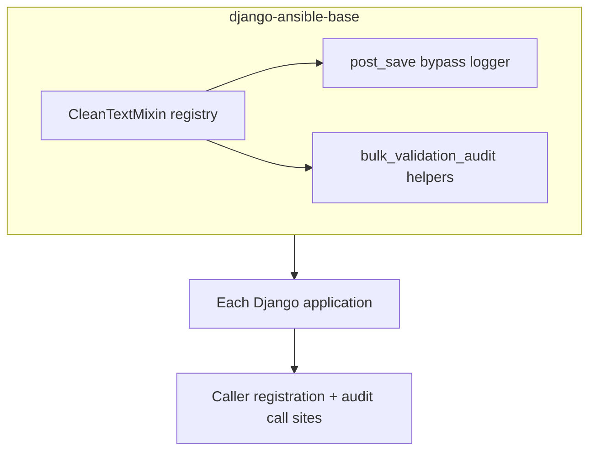

# ORM bypass observability — platform triage reference

**Audience:** Security engineering, platform leads, and service owners documenting
import/sync coverage for Product Security sign-off. This is **not** required
reading for routine DAB development.

**Main guide:** [validation_bypass_observability.md](validation_bypass_observability.md)

## Compliance context (import / sync paths)

Product Security required auditing resource-creation paths that persist data via
the ORM without DRF serializers (project sync, inventory source updates,
collection imports, and similar). Observability means **structured WARNING logs**
when registered Char/Text would fail the same Tier 1/Tier 2 rules as
`CleanTextMixin` — not blocking ORM writes. API blocking remains on serializers
and `ENHANCED_INPUT_VALIDATION_ENABLED`.

DAB cannot instrument every service from one library release. Each application
must register signals, load serializers, and add **audit call sites** at triaged
bulk and `QuerySet.update()` ingress points.

## When to add an audit call site

Use this before adding another **audit call site** (a call to `audit_bulk_*` or
`audited_queryset_update` immediately before a bulk ORM write):

1. **Is the model in the bypass registry?** (At least one loaded `CleanTextMixin`
   serializer for `Meta.model`.) If no → expand serializers first, or accept a
   blind spot.
2. **Does the bulk/update touch registered Char/Text?** For `bulk_update`, does
   `fields=` intersect registered text columns (minus `excluded_fields`)? If no →
   skip (for example JSON-only `ansible_facts` updates).
3. **Is the ingress semi-trusted?** (User bulk APIs, SCM sync, imports.) → **Add
   audit.** Internal metrics / flags → document intentional skip.
4. **Single-instance `.save()` / `.create()`** on registered models → usually
   **already covered** by DAB `post_save` after `register_validation_signals()`.

Skipping a site means **no log**, not approval of the data.

## Priority by bypass category

| Priority | Category | `post_save`? | Audit helper? |
|----------|----------|--------------|---------------|
| 1 | Bulk create/update (user/sync ingress) | No | Service call sites |
| 2 | `QuerySet.update()` on text columns | No | `audited_queryset_update` |
| 3 | Management commands (`.save()`) | Yes | Usually automatic |
| 4 | Signals / model methods | Yes if registered | Rare bulk helpers |
| 5 | Migrations / fixtures | Skip for monitoring | N/A |

## QuerySet.update() inventory (platform)

Django emits **no** `post_save` for `QuerySet.update()`. Only **literal `str`**
kwargs are validated; `F()`, `Case`, and subqueries are skipped.

| Component | Location | `update()` kwargs | Registry / text? | Hook? |
|-----------|----------|-------------------|------------------|-------|
| EDA | Project import — rulebook sync | `rulebook_rulesets`, hashes, `git_hash` | `Activation` rulesets | **Yes** — `audited_queryset_update` |
| EDA | Project import — hash-only branch | `git_hash` only | `Activation` | Helper present; audit usually no-ops |
| Controller | Various task/system paths | status, flags, ids | Often registered models | No prod `update()` on user text columns |
| Gateway | Service id sync | `service_id` | Not Tier text | No |
| Hub | Collection import | Pulp `bulk_create` / `.save()` | Grows with `CleanTextMixin` adoption | Bulk triage when registry covers import models |

## Controller bulk hook reference (example service)

Reference implementation: [ansible/awx#16672](https://github.com/ansible/awx/pull/16672)
(depends on [django-ansible-base#1147](https://github.com/ansible/django-ansible-base/pull/1147)).

Four hook surfaces (bulk never fires `post_save`):

| # | Surface | Purpose |
|---|---------|---------|
| 1 | `audit_bulk_model_instances` before host `bulk_create` | User bulk host API |
| 2 | Workflow node helper before `bulk_create` | Prompt fields in `char_prompts` |
| 3 | `audit_bulk_update_instances` in shared `bulk_update` helper | Field-scoped `bulk_update` |
| 4 | Scheduler `job_explanation` `bulk_update` | Registered text column batch |

Detailed production inventory tables from the original guide are maintained in
service PRs and manual verification docs; re-run triage when the registry grows.

## Multi-component diagram

